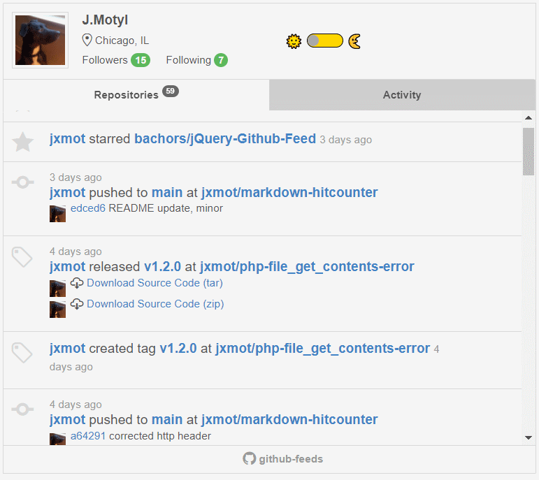
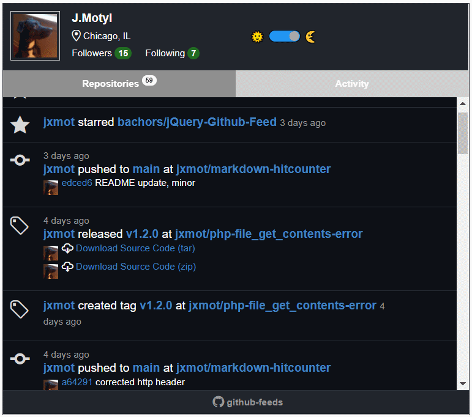

# github-feeds

This repository contains a "GitHub Feed" browser plug-in. On the backend there is a *mock* API that can replace GitHub's.  

# History

I had been searching for a *usable*, *responsive*, *working*, GitHub feed (*repositories, activity, gists*) plugin for use on my website. There are a number of them available on GitHub, but none had *exactly* what I was looking for.

I found [bachors/jQuery-Github-Feed](<https://github.com/bachors/jQuery-Github-Feed>) and at first it appeared that this one met my requirements. Unfortunately, it's really **old**. And there has not been any real activity in that repository for quite a while. 

But I grabbed a copy of it anyway and began dissecting it. I was able to find some deficiencies and a few errors. And I after I evaluated the amount of effort it would take to make changes I decided to move forward with it.

And that's what you will find here... an extensively *modified* version of [bachors/jQuery-Github-Feed](<https://github.com/bachors/jQuery-Github-Feed>). I give the original author a lot of credit for creating something *very cool*. It's already *responsive* and views well on mobile browsers.

When I started I had considered *forking* the original. However since it is old and not maintained, and because of the nature of the modifications I was going to make I decided not to fork it.

# Modifications

Here is an overview of the modifications I made to [jQuery-Github-Feed](<https://github.com/bachors/jQuery-Github-Feed>):

* Updated:
  * jQuery - updated to 3.6.0, local file in `assets/jq`
  * Octicons - updated to 3.5.0, local files in `assets/css/octicons-3.5.0`
* Changed:
  * Modified CSS, fixed some classes and added a few
  * Improved code readability, added comments
  * Can specify other API URLs for the data (*part of anti-rate limiting*)
  * Using [Shields.io](<https://shields.io/>) to display star and fork counts
  * The Gists tab is optional, it is disabled by default
  * Added an optional "scroll to top" button that appears in the footer, it is enabled by default
  * Can have more than one feed, just add a new GitHub user name (*at this time the "to top" button must be disabled*)
  * Can optionally switch between light and dark themes. 

The other *major* modification that is made here is when and how the GitHub API data is retrieved and *saved*. There is more about this in the [Anti Rate Limiting](#anti-rate-limiting) section.

## Live Demo

You can view the demo [here](<https://webexperiment.info/portfolio/ghfeeds/>).

    <figure>
<!-- NOTE: When Github renders the images it will REMOVE the "margin", and ADD "max-width:100%" -->
        
        
         
        <figcaption><strong>Light and Dark Themes.</strong></figcaption>
    </figure>

 

## Anti Rate Limiting

The GitHub API is *rate limited*. This means that you can only issue up to 60 *requests* in one hour, after than you will not be able to obtain data and the API calls will fail.

The rate limiting may not be an issue for you if the page containing the feeds doesn't have a lot of visitors. However, there are no guarantees. It's generally better to design for "high traffic" scenarios.

### A Solution

The solution is simple... get the data *in the background* and limit the number of API hits. The data is saved and when a visitor arrives to view it the saved data is used and *not* the API.

To achieve this CRON and a *shell script* are used. I set up CRON to run periodically (*every 6 to 30 minutes*) and execute the script `gfscripts/getghdata-cron.sh`

**NOTE:** You may need to modify the script file to work in your environment. Before you run it double-check the paths in variables `ghfeeds` and `gfdata`.

Another script `gfscripts/getghdata.sh`, is intended to be ran from the command line. Don't run in a CRON job.

# Usage

The following will guide you through getting the files ready and setting up the CRON job on your server. 

## Set Up

**You will need:**
* A web server with PHP >5.6, Apache >2.x is recommended
* An understanding of CRON
* A means to copy files to your server, and command-line access
* Knowledge of where your *document root* is located

### For Experts Only

If you're well versed in all things "server" you probably won't need any detailed instructions. Just look over the following sections and note what needs to be edited.

### Server Preparation

1) Get access to your web server for copying files to it, and the command line to run a shell script.

2) Find your *document root*, you will need the path to it later

### Edit Files

**`public_html/index.html`:** Find `<div id="ghdata"...` and edit `data-username="...` to the GitHub user name you want to use. **- required**

**`public_html/gfscripts/mkfolders.sh`**
* Edit `docroot=...`, this should be the path to your server's *document root* folder.
* Edit `ghfeeds="$docroot/...`, 
* Edit `gfdata="$ghfeeds/...`,

**`public_html/gfscripts/getghdata-cron.sh`**
* Edit `owner="...`, use the GitHub user name from the previous edit. **- required**
* Edit `docroot=...`, this should be the path to your server's *document root* folder.
* Optionally edit: *This is not required, the paths can be left as-is*
  * `gfdata=$docroot/ghfeeds/gfdata` - Change `ghfeeds` and `gfdata` if necessary

**`public_html/gfapi/index.php`** - Find the line `$datapath = '../gfdata/';` and change `gfdata` to match the previous edit in `getghdata-cron.sh`.

**`public_html/assets/js/github-feed.js`**
The "Gists" tab is *optional*, and it is disabled by default. To enable it find `var showgists = false;` and change it to `true`.

### Copy Files to the Server

#### Get the JSON Data

Now you should have four JSON files(*using the scripts as found*):

*

### Set Up CRON

## Run 

### Go!

# Mock GitHub API

# Changing Appearance

